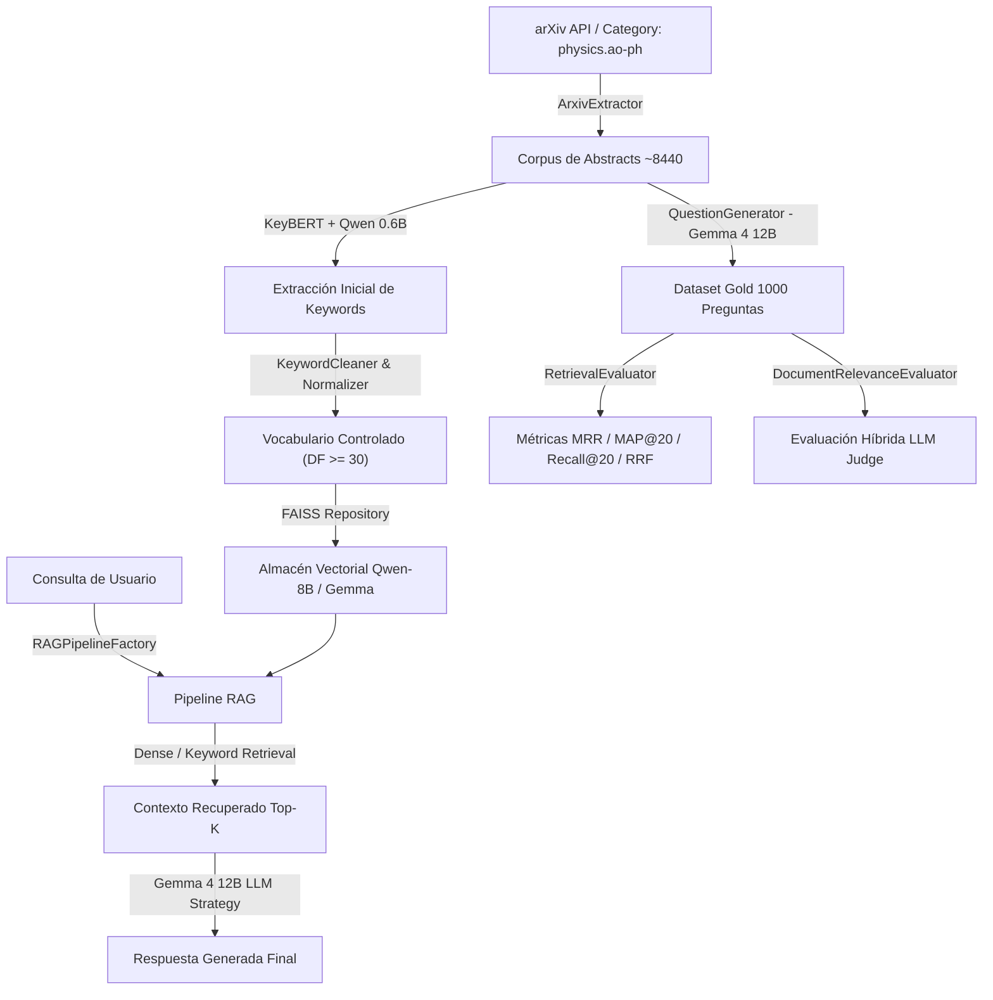

# Consultas Científicas en Ciencias Atmosféricas asistidas por RAG

KernelRAG es un framework completo de **Retrieval-Augmented Generation (RAG)** diseñado para procesar, estructurar, evaluar y responder consultas complejas sobre un corpus de artículos científicos de arXiv (categoría `physics.ao-ph`, ~8,440 abstracts).

El sistema combina **búsqueda vectorial densa** (mediante FAISS y modelos de embedding como *Qwen3-Embedding-8B* y *EmbeddingGemma-300M*) con un **vocabulario controlado de palabras clave (*keywords*)** filtrado y normalizado mediante procesamiento de lenguaje natural (NLP).

---

## 📌 Tabla de Contenidos

- [Características Principales](#-características-principales)
- [Arquitectura del Sistema](#-arquitectura-del-sistema)
- [Estructura del Proyecto](#-estructura-del-proyecto)
- [Requisitos Previos e Instalación](#-requisitos-previos-e-instalación)
- [Gestión de Datos con DVC](#-gestión-de-datos-con-dvc)
- [Guía de Uso y Scripts Principales](#-guía-de-uso-y-scripts-principales)
  - [1. Extracción de Papers de arXiv](#1-extracción-de-papers-de-arxiv-mainpy)
  - [2. Preprocesamiento, Filtrado y Analítica de Keywords](#2-preprocesamiento-filtrado-y-analítica-de-keywords-main_preprocess_keywordspy)
  - [3. Generación Sintética de Preguntas de Evaluación](#3-generación-sintética-de-preguntas-de-evaluación-main_generate_questionspy)
  - [4. Tubería RAG Interactiva/CLI](#4-tubería-rag-interactivacli-main_rag_pipelinepy)
  - [5. Evaluación de Métricas de Recuperación](#5-evaluación-de-métricas-de-recuperación-main_eval_metricspy)
  - [6. Ensamble RRF y Unión Máxima](#6-ensamble-rrf-y-unión-máxima-main_eval_rrf_unionpy)
  - [7. Evaluación Híbrida de Relevancia y Suficiencia de Documentos](#7-evaluación-híbrida-de-relevancia-y-suficiencia-de-documentos-main_eval_doc_relevance_cvpy)
- [Ejecución de Pruebas Unitarias](#-ejecución-de-pruebas-unitarias)
- [Configuración del Proyecto](#-configuración-del-proyecto)
- [Licencia](#-licencia)

---

## 💡 Características Principales

- **Arquitectura Modular (Pipes & Filters y Strategy Pattern)**: Permite intercambiar fácilmente modelos de embeddings, LLMs de generación/evaluación y componentes de preprocesamiento.
- **Vocabulario Controlado de Keywords**:
  - Extracción inicial con KeyBERT y Qwen-0.6B.
  - Normalización avanzada (lematización con SpaCy, minúsculas, corrección ortográfica con PySpellChecker).
  - Filtrado estadístico por *Document Frequency* ($DF \ge 30$) e *Inverse Document Frequency* (IDF) para eliminar ruido y términos infrecuentes (~500 keywords controladas).
- **Indexación Vectorial Multi-Modelo**:
  - Soporte para **FAISS** con embeddings *Qwen3-Embedding-8B* y *EmbeddingGemma-300M*.
  - Búsqueda híbrida y filtrada delimitando espacios vectoriales por palabras clave.
- **Generación Sintética de Preguntas Gold Standard**: Generación automatizada de 1,000 preguntas de evaluación a partir de grupos de documentos utilizando **Gemma 4 12B**.
- **Evaluación Causal y Cuantitativa de Retrieval**:
  - Métricas estándar: **MRR** (Mean Reciprocal Rank), **MAP@K** (Mean Average Precision) y **Recall@K** (para $K=20$).
  - Ensamble **Reciprocal Rank Fusion (RRF)** y cálculo de la **Unión Máxima** teórica.
  - Evaluador híbrido de **Suficiencia de Contexto** y Relevancia mediante **LLM Judge** (Gemma 4 12B) vs *Ground Truth* matemático.

---

## 🏗️ Arquitectura del Sistema



---

## 📂 Estructura del Proyecto

```text
KernelRag/
├── config/
│   └── config.yaml               # Configuración central del proyecto (rutas, parámetros, modelos)
├── data/                         # Versionado mediante DVC
│   ├── 1_raw/                    # Datos crudos de arXiv y extracción inicial
│   ├── 2_processed/              # Datasets filtrados, mapeos de keywords y vocabulario
│   ├── 3_gold/                   # Dataset de preguntas de evaluación y reportes
│   └── artifacts/                # Vocabularios e índices exportados
├── vectorStores/                 # Índices vectoriales FAISS (Qwen-8B, gemma4)
├── prompts/                      # Prompts para generación de preguntas y LLM Judge
│   ├── question_generation_v1.md
│   ├── context_sufficiency.md
│   └── document_relevance_gemma.md
├── reports/                      # Visualizaciones y figuras generadas
├── src/
│   ├── analytics/                # Módulos de analítica de keywords y evaluación de retrieval
│   │   ├── document_relevance_evaluator.py
│   │   ├── keywords_stats.py
│   │   └── retrieval_evaluator.py
│   ├── core/                     # Clases base, DTOs, configuración y fábrica RAG
│   │   ├── base.py               # Definición de Pipeline y Filter (Pipes & Filters)
│   │   ├── config.py
│   │   ├── dto.py
│   │   ├── factory.py            # RAGPipelineFactory
│   │   └── model_manager.py
│   ├── filters/                  # Filtros de extracción, transformación y RAG
│   │   ├── extract/              # arxiv_extractor.py
│   │   ├── transform/            # keyword_cleaner, keyword_extractor, question_generator, etc.
│   │   └── rag/                  # query_preprocessor, retrieval_filter, prompt_builder, generation_filter
│   ├── repositories/             # faiss_repository.py
│   └── strategies/               # embeddings.py, llm.py (Gemma12BStrategy, MockLLMStrategy)
├── tests/                        # Suite completa de pruebas unitarias (85+ tests)
├── main.py                       # Script 1: Extracción inicial de arXiv
├── main_preprocess_keywords.py   # Script 2: Filtrado y analítica de keywords
├── main_generate_questions.py    # Script 3: Generación sintética de preguntas
├── main_rag_pipeline.py          # Script 4: Ejecución interactiva/CLI del sistema RAG
├── main_eval_metrics.py          # Script 5: Evaluación de métricas (MRR, MAP@20, Recall@20)
├── main_eval_rrf_union.py        # Script 6: Evaluación RRF y Unión Máxima
├── main_eval_doc_relevance_cv.py # Script 7: Evaluación híbrida de relevancia/suficiencia
├── pyproject.toml                # Especificación del proyecto y dependencias de Python
├── uv.lock                       # Lockfile de dependencias para uv
└── README.md
```

---

## 🛠️ Requisitos Previos e Instalación

### Requisitos de Sistema
- **Python**: `>= 3.11`
- **GPU (Opcional, pero recomendada para LLM real)**: NVIDIA GPU con CUDA y $\ge 24\text{ GB}$ VRAM para ejecutar los pesos completos de `google/gemma-4-12B-it`. Para desarrollo/pruebas sin GPU, el sistema incluye estrategias *Mock*.

### 1. Clonar el repositorio
```bash
git clone https://github.com/alejandro7177/PFC-LSI.git KernelRag
cd KernelRag
```

### 2. Crear y activar el entorno virtual

Se recomienda usar **[`uv`](https://github.com/astral-sh/uv)** por su velocidad y soporte para `uv.lock`, aunque también se puede utilizar `venv` estándar y `pip`.

#### Usando `uv` (Recomendado):
```bash
# Crear entorno virtual con Python 3.11
uv venv

# Activar entorno virtual
source .venv/bin/activate

# Sincronizar e instalar dependencias
uv sync
```

#### Usando `pip` estándar:
```bash
python3.11 -m venv .venv
source .venv/bin/activate
pip install -e .
```

### 3. Descargar el modelo de lenguaje de SpaCy
El módulo de normalización de keywords requiere el modelo `en_core_web_sm` para lematización:
```bash
python -m spacy download en_core_web_sm
```

---

## 📦 Gestión de Datos con DVC

El proyecto utiliza **[DVC (Data Version Control)](https://dvc.org/)** para controlar versiones de grandes datasets, reportes e índices vectoriales almacenados en Hugging Face Hub.

Para synchronizar los datos crudos, procesados y almacenes vectoriales en tu entorno local:

```bash
# Descargar todos los artefactos de datos y almacenes vectoriales FAISS
dvc pull
```

---

## 🚀 Guía de Uso y Scripts Principales

### 1. Extracción de Papers de arXiv ([main.py](file:///home/coene/projects/KernelRag/main.py))
Descarga abstracts de la categoría `physics.ao-ph` mediante la API de arXiv y genera las keywords iniciales.

```bash
python main.py
```
* **Salida**: `data/1_raw/papers_processed.csv`

---

### 2. Preprocesamiento, Filtrado y Analítica de Keywords ([main_preprocess_keywords.py](file:///home/coene/projects/KernelRag/main_preprocess_keywords.py))
Aplica el filtrado por frecuencia de documento ($DF \ge 30$), lematización, limpieza y generación de gráficos descriptivos (distribución Zipf, histogramas, n-gramas, wordcloud).

```bash
# Acción 1: Filtrar dataset y generar métricas estadísticas
python main_preprocess_keywords.py --action filter \
    --input_csv data/1_raw/dataset.csv \
    --valid_kw_json data/2_processed/kw_mapping_df30.json

# Acción 2: Generar visualizaciones descriptivas de las keywords
python main_preprocess_keywords.py --action visualize \
    --valid_kw_json data/2_processed/kw_mapping_df30.json
```
* **Salidas**: Datasets filtrados en `data/2_processed/` y gráficos en `data/2_processed/plots_YYYYMMDD_HHMMSS/`.

---

### 3. Generación Sintética de Preguntas de Evaluación ([main_generate_questions.py](file:///home/coene/projects/KernelRag/main_generate_questions.py))
Genera preguntas sintéticas tipo Gold Standard a partir de agrupaciones de abstracts utilizando un LLM (*Gemma 4 12B*).

```bash
python main_generate_questions.py \
    --csv_path data/dataset.csv \
    --output_csv_path data/3_gold/questions_v1_1000.csv \
    --num_questions 1000 \
    --model_name google/gemma-4-12B-it \
    --batch_size 16
```
* **Salida**: Dataset de evaluación en `data/3_gold/questions_v1_1000.csv`.

---

### 4. Tubería RAG Interactiva/CLI ([main_rag_pipeline.py](file:///home/coene/projects/KernelRag/main_rag_pipeline.py))
Ejecuta la tubería completa de RAG para responder una consulta. Soporta estrategias de recuperación densa (`dense`), filtrada por keyword (`keyword`) o simulación (`mock`).

```bash
# Modo 1: Prueba rápida con Mock LLM y recuperación densa
python main_rag_pipeline.py \
    --query "¿Cuáles son los modelos principales de dinámica atmosférica?" \
    --strategy dense \
    --top_k 5

# Modo 2: Recuperación delimitada por Keyword en el espacio vectorial
python main_rag_pipeline.py \
    --query "análisis de flujo turbulento en la atmósfera" \
    --strategy keyword \
    --keyword "turbulence"

# Modo 3: Ejecución completa con los pesos reales de Gemma 4 12B en GPU
python main_rag_pipeline.py \
    --query "climate change models" \
    --strategy dense \
    --use_gemma_real
```

---

### 5. Evaluación de Métricas de Recuperación ([main_eval_metrics.py](file:///home/coene/projects/KernelRag/main_eval_metrics.py))
Calcula las métricas cuantitativas **MRR**, **MAP@20** y **Recall@20** sobre el dataset de preguntas Gold Standard evaluando los modelos de embedding (ej. Qwen vs Gemma).

```bash
python main_eval_metrics.py \
    --csv_path data/3_gold/questions_v1_1000.csv \
    --top_k 20 \
    --output_summary_csv data/3_gold/metrics_summary.csv
```
* **Salidas**: Resumen global en `metrics_summary.csv` y desglose por pregunta en `questions_v1_1000_evaluated.csv`.

---

### 6. Ensamble RRF y Unión Máxima ([main_eval_rrf_union.py](file:///home/coene/projects/KernelRag/main_eval_rrf_union.py))
Evalúa el rendimiento al aplicar **Reciprocal Rank Fusion (RRF)** entre múltiples modelos de embedding (Qwen + Gemma) y calcula el límite empírico máximo (*Unión Máxima*).

```bash
python main_eval_rrf_union.py \
    --csv_path data/3_gold/questions_v1_1000.csv \
    --k_rrf 60 \
    --top_n 20
```
* **Salidas**: `data/3_gold/questions_v2_rrf_union.csv` y `data/3_gold/rrf_union_summary.csv`.

---

### 7. Evaluación Híbrida de Relevancia y Suficiencia de Documentos ([main_eval_doc_relevance_cv.py](file:///home/coene/projects/KernelRag/main_eval_doc_relevance_cv.py))
Ejecuta una evaluación cruzada de suficiencia contextual comparando el juicio de un **LLM Judge** (*Gemma 4 12B*) frente al *Ground Truth* matemático.

```bash
# Evaluación híbrida rápida en modo simulado
python main_eval_doc_relevance_cv.py \
    --csv_path data/3_gold/questions_v1_1000.csv \
    --eval_mode hybrid \
    --top_k 20

# Evaluación real con LLM Judge en GPU
python main_eval_doc_relevance_cv.py \
    --csv_path data/3_gold/questions_v1_1000.csv \
    --eval_mode hybrid \
    --use_gemma_real \
    --top_k 20
```
* **Salidas**: `data/3_gold/doc_relevance_cv_summary.csv` y `data/3_gold/doc_relevance_cv_detailed.csv`.

---

## 🧪 Ejecución de Pruebas Unitarias

El proyecto incluye una suite completa de 85+ pruebas unitarias con alta cobertura utilizando `pytest`.

Para ejecutar el conjunto completo de pruebas:

```bash
# Con uv:
uv run pytest

# O activando el entorno virtual:
pytest
```

Para generar un reporte de cobertura de código:
```bash
pytest --cov=src --cov-report=term-missing
```

---

## ⚙️ Configuración del Proyecto

Todos los hiperparámetros, nombres de modelos, rutas de entrada/salida y constantes del sistema se centralizan en el archivo de configuración [config/config.yaml](file:///home/coene/projects/KernelRag/config/config.yaml).

Algunas opciones configurables clave:

| Sección | Parámetro | Descripción |
| :--- | :--- | :--- |
| `keyword_cleaner` | `min_df_threshold` | Umbral mínimo de frecuencia de documento ($DF \ge 30$). |
| `faiss_repository` | `model_name` | Modelo de embedding principal (`Qwen/Qwen3-Embedding-8B`). |
| `rag_system` | `llm.model_name` | Modelo generativo LLM (`google/gemma-4-12B-it`). |
| `evaluation` | `top_k` | Número de documentos recuperados a evaluar en Top-K. |

---

## 📄 Licencia

Este proyecto está bajo la licencia especificada en la distribución de la tesis y laboratorio de investigación del departamento PFC-LSI.
